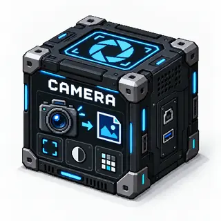

# Camera Photo

<!-- block-metadata:start -->

Verified BloxSmith versions: **1.0.9** (bundled-block tests; see [test evidence](compatibility.json)).
<!-- block-metadata:end -->

*Concept illustration. [Artwork and generation prompt](media/README.md).*

Capture a still image from the operator's browser camera and save it on the server.

## Behavior

- Open the camera from the node card, its camera icon or the modal through `getUserMedia`.
- Request the rear camera on phones by default through `facingMode: environment`.
- Capture a still image in the block's HTML and upload it to the block.
- Save it in `exports/camera/` or the configured directory.
- Emit the most recently saved image path on `photo`.

## Ports

There are no default inputs. The inspector still shows its input section to keep custom-port editing consistent with other blocks.

Output **`photo`** emits the captured image path as `image/path`, `file/path` and `message/*`.

## Configuration

- `resolution`: requested browser resolution; default `1280x720`.
- `camera_facing`: `environment` (rear, default) or `user` (front).
- `jpeg_quality`: canvas JPEG quality, from `0.1` to `1`.
- `output_dir`: workspace-relative output directory; default `exports/camera`.
- `latest_capture_path`: path of the last saved capture.
- `latest_capture_mime`, `latest_capture_at`: capture metadata.

## Usage

1. Click the card or camera icon on the canvas or compact mobile view, and grant browser camera access.
2. Use the live preview to frame the image, then press the capture button.
3. The block saves the image and immediately closes the camera.
4. Run the workflow to emit the latest saved photo path.

The modal is also available: choose **Open camera** (`Ouvrir camera`), then **Capture and save** (`Capturer et enregistrer`). `assets/js/block_modal.js` owns modal capture and remains autonomous during runtime polling so an open preview is not interrupted. Persistent settings are applied through the generic framework contract.

## Compact card

The `mini/` directory owns the mobile rendering:

- `mini/node_card.html`: compact capture card.
- `mini/node_card.css`: small-screen styles.
- `mini/node_card.js`: `camera_photoMiniNodeCard` handler, delegating capture to the available camera behavior or generic compact API.

## Dependencies and execution

The server needs no local camera, `ffmpeg` or `fswebcam`. The browser must support `navigator.mediaDevices.getUserMedia`, and the operator must grant access. Browsers generally require a secure origin or localhost.

The block uses the generic runtime in One Shot Simulation (`centralized`) and Active Runtime (`zeromq_active`). Running before a photo has been saved from the card or modal fails with an explicit log message.

## Compatibility policy

[compatibility.json](compatibility.json) records HackInvent's verified BloxSmith versions and test evidence. Only the versions listed above have been verified, using the block-owned suites in a **bundled-block test installation**. This is not a certification of managed-package installation, every browser/OS, or live provider availability. Other framework versions are unverified, not necessarily incompatible.

The block-version badge follows `model.json`, not a published Git tag. `unversioned` means that no block release version is declared; no number is inferred from the framework version. The framework still uses `model.json` for its runtime/install contract; the tester-owned JSON does not replace it. Official integration tests run in the private `bloxmith-blocs` workspace. Test helpers and the proprietary framework are not bundled in this public block repository.

## Properties ergonomics

Modal and inspector styles are owned by this package and scoped to its exact
release. Forms adapt to narrow panels, checkboxes stay beside their labels, and
long values do not widen the inspector. Existing labels are associated with
controls; keyboard navigation complements the block’s own tab handlers.
These presentation helpers do not change port bindings, authored settings,
runtime behavior or the block’s original surface cleanup.
